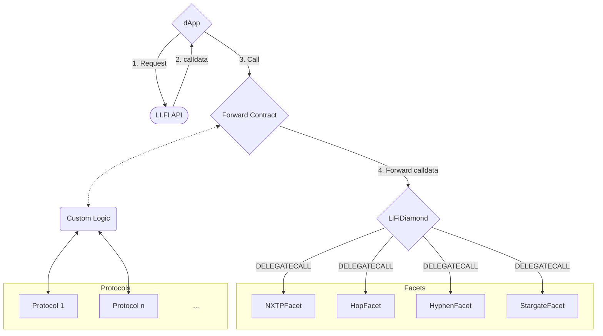

# LI.FI Contract Examples

This repository contains examples of the smart contracts that interact with LI.FI Diamond.

## How It Works<a name="how-it-works"></a>

1. Send request to the LI.FI API.
2. Get calldata from the LI.FI API.
3. Pass the calldata, the address of LI.FI Diamond contract and token information to demo contracts.
4. Custom logics can be implemented(as ForwardWithCustomLogic) to do some actions such as swaps, unstaking, etc before forwarding calldata.
5. In the contracts, they set approval for the LI.FI Diamond.
6. Execute the call data on the LI.FI contracts.

## Contract Flow<a name="contract-flow"></a>



## Repository Structure<a name="repository-structure"></a>

```
contracts
│ README.md                         // you are here
│ ...                               // setup and development configuration files
│
├─── src                            // the contract code
│   ├── interfaces                  // interface definitions
│   ├── utils                       // utility contracts
│   ├── Forward.sol                 // example contract to forward calldata
│   └── ForwardWithCustomLogic.sol  // example contract to forward calldata with custom logic
│
└─── test                           // contract unit tests
    ├─── Forward                    // tests for Forward contract
    └─── ForwardWithCustomLogic     // tests for ForwardWithCustomLogic contract
```
